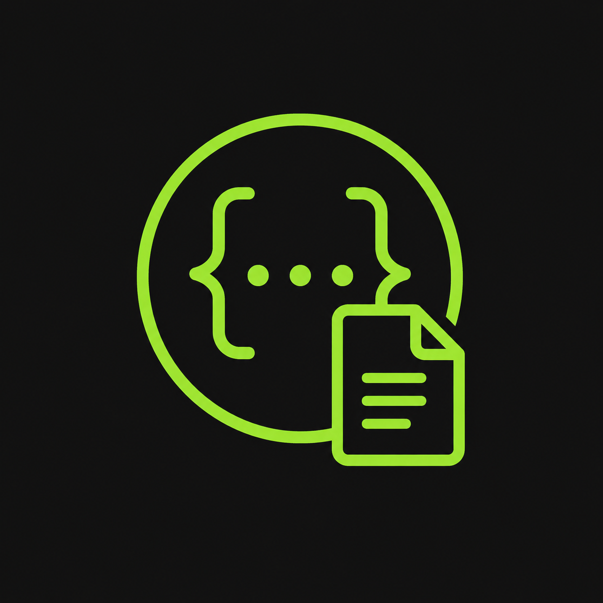

<p align="center">
  
</p>

# Swagger Spec Copy

A Chrome extension that adds **Copy Controller** and **Copy Endpoint** buttons to [Swagger UI](https://swagger.io/tools/swagger-ui/) pages. One click copies structured **Markdown** to your clipboard — ready to paste into an AI coding agent for API integration.

Works with local Swagger docs, internal APIs, and public documentation. No server changes required.

---

## Why this exists

Integrating APIs with AI agents usually means manually copying endpoint details from Swagger — method, path, parameters, body, responses, auth. That is slow, inconsistent, and easy to get wrong.

Swagger Spec Copy reads the **OpenAPI specification** behind Swagger UI and formats it as clean Markdown that agents can parse reliably.

---

## Features

- **Copy Endpoint** — one operation with method, path, operation ID, tags, description, security, parameters, request body, and responses
- **Copy Controller** — all endpoints under an OpenAPI tag (controller) in a single Markdown document
- **OpenAPI-first** — resolves the spec from Swagger UI, `swagger-ui-init.js`, and api-docs URLs (e.g. `/v3/api-docs`)
- **No expand required** — parameters and schema defaults come from the spec; you do not need to open each endpoint first
- **Try it out overlay** — if an endpoint is expanded and you fill parameter inputs, those values are included in the copy
- **Grouped APIs** — supports Springdoc-style multi-document setups (`/v3/api-docs/Customers`, etc.)
- **UI integration** — pill-shaped buttons beside Swagger tag headers and operation rows, with toast feedback
- **Privacy-first** — runs entirely in the browser; clipboard only, no data sent to external servers

---

## Quick start

### Install from source

**Requirements:** [Node.js](https://nodejs.org/) 20+, [Google Chrome](https://www.google.com/chrome/)

```bash
git clone https://github.com/AhmedMahmoud929/SwaggSpec.git
cd swagg-spec
npm install --legacy-peer-deps
npm run build
```

### Load in Chrome

1. Open `chrome://extensions`
2. Enable **Developer mode** (top right)
3. Click **Load unpacked**
4. Select the `dist` folder inside the project

The extension is now active on Swagger UI pages.

---

## Usage

1. Open any page that runs Swagger UI (localhost, staging, production).
2. Use the injected buttons:
   - **Copy Controller** — on a tag section header (e.g. `Customers`, `Wallets`)
   - **Copy Endpoint** — on an individual operation row (visible on hover)
3. Paste the Markdown into your AI agent.

### Example prompt

```text
Integrate this API endpoint into our React app using fetch and TypeScript types:

[paste copied Markdown here]
```

### What gets copied

Each endpoint Markdown block includes (when defined in the spec):

| Section | Content |
|---------|---------|
| Overview | Method, path, operation ID, tags, deprecated flag |
| Description | Operation summary and description |
| Security | Bearer, API key, OAuth schemes |
| Parameters | Path, query, header, and cookie params with types and examples |
| Request body | Content types, JSON schema, examples |
| Responses | Status codes, schemas, and examples |
| Example request | Built URL when parameter values are available |

---

## Development

### Scripts

| Command | Description |
|---------|-------------|
| `npm run dev` | Build extension in watch mode |
| `npm run build` | Typecheck and build to `dist/` |
| `npm test` | Run unit tests |
| `npm run test:watch` | Run tests in watch mode |
| `npm run icons` | Regenerate extension icons |

### Dev workflow

```bash
npm run dev
```

After code changes:

1. Wait for the build to finish
2. Reload the extension at `chrome://extensions`
3. Refresh the Swagger page

### Debug logging

Click the extension icon in the toolbar and enable **Enable debug logging**. Open DevTools on the Swagger page and filter the console for `[swagg-spec]`.

---

## How it works

```
Swagger UI page
      │
      ▼
Content script injects copy buttons
      │
      ▼
OpenAPI resolution (in order)
  1. window.ui.specJson()
  2. swagger-ui-init.js → api-docs URL
  3. swagger-config (grouped specs)
  4. Embedded scripts / spec URL fallback
      │
      ▼
Markdown builder (endpoint or controller)
      │
      ▼
Clipboard
```

The extension uses [Manifest V3](https://developer.chrome.com/docs/extensions/mv3/intro/), TypeScript, and [Vite](https://vitejs.dev/) with [@crxjs/vite-plugin](https://crxjs.dev/vite-plugin).

---

## Project structure

```text
swagg-spec/
├── extension/
│   ├── manifest.json          # Chrome extension manifest
│   ├── src/
│   │   ├── background/        # Service worker
│   │   ├── content/           # DOM injection and MutationObserver
│   │   ├── markdown/          # Markdown builders
│   │   ├── openapi/           # Spec resolution, init.js parsing, $ref handling
│   │   ├── ui/                # Buttons and toasts
│   │   └── popup/             # Extension popup (debug toggle)
│   └── styles/                # Button and toast styles
├── fixtures/                  # Sample OpenAPI specs for tests
├── tests/                     # Unit tests (Vitest)
├── scripts/                   # Icon generation
├── project-proposal.md        # Original design document
└── dist/                      # Build output (load this in Chrome)
```

---

## Testing

```bash
npm test
```

Tests cover Markdown generation, OpenAPI resolution, `swagger-ui-init.js` parsing, and DOM parameter merging.

---

## Compatibility

| Environment | Support |
|-------------|---------|
| Chrome (Manifest V3) | Yes |
| Swagger UI 3.x / 4.x | Yes |
| OpenAPI 3.x | Yes |
| Springdoc / `swagger-ui-init.js` | Yes |
| localhost & internal URLs | Yes |
| Firefox / Safari | Not yet |

---

## Permissions

| Permission | Reason |
|------------|--------|
| `storage` | Persist debug logging toggle |
| `<all_urls>` | Swagger docs run on many origins (localhost, staging, production) |

No browsing history, analytics, or remote data collection.

---

## Contributing

Contributions are welcome.

1. Fork the repository
2. Create a feature branch (`git checkout -b feature/my-change`)
3. Make your changes and add tests where relevant
4. Run `npm test` and `npm run build`
5. Open a pull request

Please keep changes focused and match the existing code style.

---

## Roadmap

- [ ] Narrow host permissions via user-configurable allowlist
- [ ] Firefox / Edge support
- [ ] Optional `curl` command in Markdown output
- [ ] OpenAPI 2.0 (Swagger 2.0) support
- [ ] E2E tests with Playwright

See [`project-proposal.md`](project-proposal.md) for the full original specification.

---

## License

MIT — see [LICENSE](LICENSE) for details.

---

## Acknowledgments

Built for developers who use Swagger UI daily and want a faster path from API docs to AI-assisted integration.
